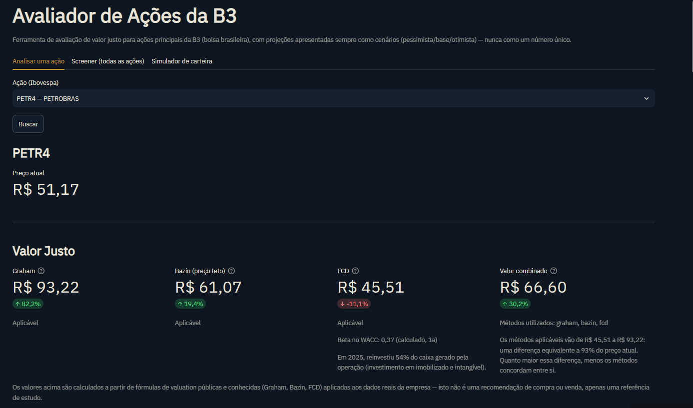
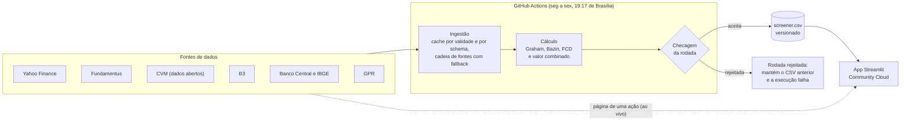
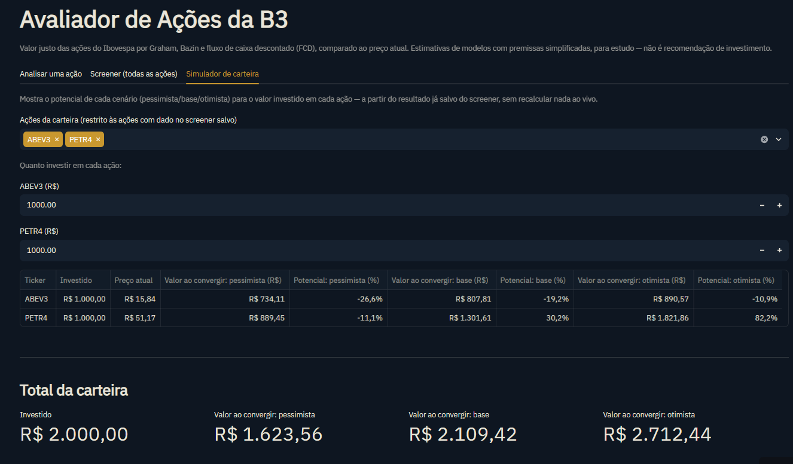

# Avaliador de Ações da B3

Dashboard em Python que estima o valor justo das ações do Ibovespa por Graham, Bazin e fluxo de caixa descontado, com os dados atualizados todo dia útil por um workflow do GitHub Actions.

[](https://github.com/gustavocduarte/avaliador-acoes-b3/actions/workflows/ci.yml)
[](https://github.com/gustavocduarte/avaliador-acoes-b3/actions/workflows/atualiza-screener.yml)

**App publicado:** https://gustavocduarte-avaliador-acoes-b3.streamlit.app

**Aviso:** os valores são estimativas de modelos com premissas simplificadas, para estudo. Não é recomendação de investimento. As limitações dos modelos e dos dados estão em [`docs/limitacoes-conhecidas.md`](docs/limitacoes-conhecidas.md).



## Arquitetura



## Destaques técnicos

- **Cadeia de fontes com fallback:** a Selic e o IPCA passam pela API do Banco Central, pelo serviço SOAP, pelo IBGE (só o IPCA), pelo último valor guardado e pelo arquivo de referência versionado; a tela informa a fonte efetiva. O ano da demonstração da CVM é detectado por empresa, e a empresa que ainda não entregou o ano mais recente usa o anterior.
- **Checagem que impede publicar rodada ruim:** a rodada só substitui o `screener.csv` se tiver uma linha por ação, no máximo 5 ações sem preço e no máximo 5 com falha de fonte; senão vira `screener.rejeitado.csv`, o resultado anterior fica e a execução do workflow falha.
- **Gravação atômica:** o screener e os zips da CVM são gravados num arquivo temporário e trocados no fim, então uma falha no meio nunca corrompe o arquivo anterior.
- **Cache versionado por schema:** cada cache em disco leva a versão do formato, e uma mudança de formato invalida os arquivos antigos; os zips do ano corrente da CVM expiram em 7 dias e os de anos fechados são permanentes.
- **Testes sem rede:** mais de 800 testes, com **96% de cobertura** (linhas e ramos), sem acessar a rede nem gravar em `data/`; inclui testes de interface com o `AppTest` do Streamlit.
- **Tipagem e CI:** `mypy` e `ruff` em todo o código, e um workflow que roda testes, lint, formatação e tipos a cada push e pull request.
- **Decisões registradas:** cada mudança de metodologia passa por uma investigação só de leitura, com relatório que separa o confirmado nos dados da hipótese (pasta `docs/`).

## Tecnologias

- **Aplicação:** Python 3.12 ou mais recente (o CI roda na 3.14), Streamlit, pandas, NumPy, Plotly, `yfinance`, `requests`, Beautiful Soup e `xlrd`.
- **Qualidade:** pytest com pytest-cov, ruff e mypy.
- **Entrega:** GitHub Actions (CI e atualização agendada) e Streamlit Community Cloud (o app publicado).

## O que o app faz

Para cada ação, calcula o valor justo por três métodos e um valor combinado:

- **Graham** — raiz quadrada de `22,5 × LPA × VPA`; só se aplica com LPA e VPA
  positivos.
- **Bazin** — preço teto para um dividend yield mínimo de 6% a.a., sobre os
  dividendos dos últimos 12 meses; só se aplica com histórico de dividendos
  relevante (5 anos).
- **FCD** (Fluxo de Caixa Descontado) — projeta o fluxo de caixa livre e
  desconta pelo WACC (ver a metodologia abaixo).
- **Combinado** — média simples só dos métodos que se aplicam àquela ação.

O dashboard tem três abas:

- **Analisar uma ação** — valor justo pelos três métodos e o combinado contra o
  preço atual, saúde financeira (ROE, margem, dívida, valor de mercado e de
  firma), governança, comportamento da ação (volume, volatilidade, Beta),
  preço contra o Ibovespa, histórico de dividendos, **Comparação setorial** e
  correlação com fatores externos (petróleo, câmbio e risco geopolítico).
- **Screener (todas as ações)** — a mesma avaliação para todo o Ibovespa, com
  potencial, divergência entre métodos, avisos e a proporção do caixa
  operacional reinvestida. O resultado fica salvo em
  `data/processed/screener.csv` (versionado, para o app publicado ter dados
  desde o primeiro acesso) e é atualizado pelo workflow agendado. O botão
  "Rodar screener agora" só aparece na execução local, com o opt-in descrito em
  "Instalação, execução e testes".
- **Simulador de carteira** — dado um valor investido por ação, mostra o
  potencial da carteira nos cenários pessimista (menor valor entre os métodos
  aplicáveis), base (valor combinado) e otimista (maior valor), a partir do
  resultado já salvo do screener. É potencial sem prazo: o valor justo é um
  valor de hoje, não uma previsão de retorno anual.



## Metodologia do FCD

- **Fluxo de caixa livre:** caixa das operações (6.01) menos o capex explícito (compras de
  imobilizado e intangível nas subcontas de 6.02, identificadas pela descrição), somando de
  volta os juros de empréstimos lançados em 6.01, líquidos do imposto (34%). Sem capex
  identificado, o FCD não é calculado. A saída líquida de linhas de 6.03 descritas como
  convênio com fornecedores, risco sacado, forfait ou cessão de crédito por fornecedores é
  tratada como operacional e reduz o caixa das operações, no ano de referência e no ano-base;
  entradas não são ajustadas, e a tela diz o valor reclassificado. A coluna Reinvestimento e a
  legenda "reinvestiu X%" usam esse mesmo caixa das operações (com os juros somados de volta).
- **Projeção:** 5 anos com crescimento pelo CAGR do fluxo entre o ano de referência e 5 anos
  antes, limitado por cima pelo CAGR da receita líquida (DRE, conta 3.01) no mesmo período e
  mantido entre −20% e +30% ao ano; sem receita utilizável, vale o do fluxo, e a tela diz o
  motivo. O crescimento do ano 1 converge linearmente para o da perpetuidade no ano 5, sem salto.
  A perpetuidade (Gordon) cresce pelo IPCA de 12 meses, limitado a 1 p.p. abaixo do WACC. Sem
  histórico utilizável (base ausente ou não positiva), o crescimento cai para o IPCA, e a tela
  diz o motivo.
- **WACC:** custo do capital próprio pelo CAPM ((Selic − spread de default do Brasil de 2,13%)
  + Beta × prêmio de risco do Brasil de 7,47%, da tabela do Damodaran de janeiro de 2026; Beta
  calculado contra o Ibovespa em 1 ano, ou 1,0 se não for calculável) e custo da dívida de
  (Selic + 2 p.p.) pós-imposto. Os pesos usam valores contábeis, não de mercado:
  dívida líquida sobre patrimônio líquido total (controladores e não controladores); sem dívida
  líquida positiva, a empresa é tratada como não alavancada.
- **Do valor da empresa ao valor por ação:** do valor presente (Enterprise
  Value) subtrai-se a dívida líquida, o arrendamento fora da dívida e a
  participação dos não controladores, e divide-se pelas ações em circulação
  (capital integralizado menos tesouraria, pela composição do capital da CVM).
  Os ajustes vêm do balanço consolidado da CVM na data-base do Fundamentus;
  componente indisponível fica de fora, e a tela avisa. Nas units, a composição
  da CVM é convertida pelo peso econômico das ações que formam a unit (tabela de
  composições em `config.py`), e o fator de unit do Fundamentus segue como a fonte
  do valor por unit; a tela avisa quando ele não bate com a tabela.
- **Não aplicável:** bancos, seguradoras e a Itaúsa (a dívida e os depósitos são a própria
  operação, ou a empresa vive de dividendos de participações); capex não identificado; fluxo
  de caixa livre do ano de referência zero ou negativo; empresa sem dados de fluxo de caixa na
  CVM; número de ações indisponível; WACC não positivo. Valor justo zero ou negativo é mostrado
  com aviso, não zerado.
- **Aviso de valor extremo:** quando o FCD é zero ou negativo, a partir de 3 vezes o preço ou
  positivo mas até 10% do preço, o cartão do FCD mostra a causa provável nas entradas do modelo
  (deduções acima do valor da empresa, crescimento no teto ou no piso da faixa, perpetuidade
  pesada, WACC baixo). É só informativo: não altera o valor.

A justificativa de cada constante está em `src/avaliador_b3/config.py`.

## Fontes de dados

| Fonte | Para quê |
|---|---|
| Yahoo Finance (`yfinance`) | preços, dividendos, Ibovespa (Beta), petróleo e câmbio |
| Fundamentus | indicadores (LPA, VPA, ROE, margem, dívida líquida) e número de ações |
| CVM (dados abertos) | fluxo de caixa (DFP/ITR), balanço consolidado e composição do capital |
| B3 | universo do Ibovespa, catálogo de emissores (CNPJ e segmento setorial) |
| Banco Central (SGS) | Selic meta (série 432), IPCA mensal (433) e câmbio (série 1) |
| IBGE (SIDRA) | IPCA mensal, terceira fonte do IPCA |
| GPR (Caldara e Iacoviello) | índice de risco geopolítico |

A Selic e o IPCA seguem uma cadeia de fontes: API REST do Banco Central,
serviço SOAP do Banco Central, IBGE (só o IPCA), o último valor obtido com
sucesso (guardado em disco, válido por 45 dias) e, por fim, o arquivo de
referência `data/processed/macro_referencia.json`, gravado a cada rodada
aceita do screener e versionado junto com o `screener.csv` (válido por 90 dias).
Quando o dado não vem da API REST do Banco Central, a página informa a fonte
efetiva, e quando vem do valor guardado ou do arquivo de referência, mostra um
aviso com a data.

## Instalação, execução e testes

Requer **Python 3.12 ou mais recente**.

```bash
python -m venv .venv

# Linux/macOS:
source .venv/bin/activate
# Windows (PowerShell):
.venv\Scripts\Activate.ps1
```

Para só rodar o app (é o que o Streamlit Community Cloud instala):

```bash
pip install -r requirements.txt
```

Para desenvolver (inclui pytest, pytest-cov, ruff e mypy; o `-e .` instala o pacote em modo
editável, o que permite rodar `python -m avaliador_b3.rodar_screener` de qualquer pasta):

```bash
pip install -r requirements-dev.txt -e .
```

Rodar o dashboard, a partir da raiz do repositório:

```bash
streamlit run src/avaliador_b3/app/main.py
```

O botão "Rodar screener agora" (aba Screener) **não aparece por padrão**: no app publicado,
qualquer visitante poderia disparar uma rodada de ~228 requisições, então o screener só é
atualizado pelo workflow. Para habilitá-lo na sua máquina, ligue a variável de ambiente
`AVALIADOR_B3_PERMITIR_RODAR_SCREENER` (valores aceitos: `1`, `true`, `yes`, `sim` ou `on`)
antes de iniciar o app:

```powershell
# Windows (PowerShell), na sessão em que vai rodar o app:
$env:AVALIADOR_B3_PERMITIR_RODAR_SCREENER = "1"
streamlit run src/avaliador_b3/app/main.py
```

```bash
# Linux/macOS:
AVALIADOR_B3_PERMITIR_RODAR_SCREENER=1 streamlit run src/avaliador_b3/app/main.py
```

Alternativa, sem repetir a variável a cada sessão: crie o arquivo `.streamlit/secrets.toml`
(já ignorado pelo Git) com a mesma chave.

```toml
AVALIADOR_B3_PERMITIR_RODAR_SCREENER = true
```

Sem o opt-in, a aba mostra que o workflow atualiza o screener nos dias úteis, com a data da
última atualização.

Rodar os testes e as verificações de código (as mesmas do CI):

```bash
pytest
ruff check .
ruff format --check src tests
python -m mypy
```

Relatório de cobertura (hoje, 96%):

```bash
pytest --cov --cov-report=term-missing:skip-covered
```

Os testes não acessam a rede e não gravam em `data/`.

## Atualização do screener

O `data/processed/screener.csv` é atualizado por um workflow do GitHub Actions, o "Atualiza o screener" (`.github/workflows/atualiza-screener.yml`). Ele roda **de segunda a sexta às 19:17 de Brasília** (22:17 UTC, depois do fechamento da B3; o GitHub pode atrasar a execução em alguns minutos) e também pode ser **disparado manualmente**. A cada execução faz a rodada completa e publica o resultado como arquivo da execução (artifact).

- **Quando commita:** só quando a rodada é aceita e o `screener.csv` mudou (num feriado, por exemplo, não muda e nada é commitado). Aí grava o `screener.csv` e o `macro_referencia.json` no `master`, com autor `github-actions[bot]` e mensagem "Atualiza o screener (rodada de AAAA-MM-DD)"; o corpo do commit traz o resumo da rodada.
- **Quando falha:** se a rodada é rejeitada pela checagem ou termina com exceção, a execução fica em **falha** (vermelha na aba Actions; o GitHub avisa por e-mail conforme as notificações de quem mantém o agendamento) e nada é commitado, então o screener anterior continua valendo. Os arquivos da rodada, inclusive o `screener.rejeitado.csv`, continuam disponíveis como artifact.
- **Sincronizar:** como o workflow commita no `master`, convém rodar `git pull` antes de começar a trabalhar.
- **Agendamento parado:** em repositório público, o GitHub desliga os agendamentos depois de 60 dias sem atividade no repositório; para reativar, use a aba Actions.
- **Onde ver as execuções:** na aba **Actions** do repositório (<https://github.com/gustavocduarte/avaliador-acoes-b3/actions>), workflow "Atualiza o screener". Cada execução mostra o resumo da rodada (aceita ou rejeitada, falhas de fonte, fonte da Selic e do IPCA, data dos preços, se houve commit) e, no fim da página, o artifact `screener-<número>` para baixar. Os commits do workflow aparecem no histórico do `master` com o autor `github-actions[bot]`.
- **Rodar manualmente:** Actions, "Atualiza o screener", "Run workflow". Uma execução manual no `master` também commita, nas mesmas condições.
- **Pela linha de comando**, a partir da raiz do repositório e com o pacote instalado (`pip install -e .`); é o mesmo procedimento do botão "Rodar screener agora" (que só existe com o opt-in acima) e grava o `data/processed/screener.csv`:

  ```bash
  python -m avaliador_b3.rodar_screener
  ```

  Sai com 0 quando a rodada é aceita, 1 quando a checagem a rejeita e 2 quando uma exceção a interrompe.

## Documentação técnica

A pasta `docs/` guarda a especificação e os relatórios técnicos do projeto. O processo é sempre o mesmo: uma auditoria ou vistoria aponta um problema, o problema é confirmado no código antes de qualquer correção, uma investigação só de leitura compara as alternativas (separando o confirmado nos dados da hipótese) e a decisão é registrada antes de implementar.

- `especificacao.md` — especificação original do projeto.
- `limitacoes-conhecidas.md` — limitações dos modelos e dos dados, para quem usa o app.
- Auditorias e vistorias: `auditoria-2026-09-18.md`,
  `vistoria-pre-publicacao-2026-09-20.md`, `bateria-testes-2026-09-21.md`,
  `auditoria-tecnica-2026-09-27.md`, `vistoria-2026-09-28.md` e
  `vistoria-2026-09-28-b.md`.
- Correções: `correcoes-2026-09-22.md`, `correcao-fcd-2026-09-23.md`,
  `correcao-ano-fcd-2026-09-23.md` e `correcao-cnpj-2026-09-25.md`.
- Investigações: `investigacao-p03-p04-2026-10-02.md` (valor por ação do FCD,
  não controladores, número de ações, fator de unit e as decisões que resultaram nele),
  `investigacao-p10-2026-10-04.md` (crescimento do FCD e prêmio de risco),
  `investigacao-fluxo-base-2026-10-04.md` (capital de giro e risco sacado) e
  `investigacao-ciclicas-2026-10-04.md` (normalização do fluxo-base das empresas cíclicas,
  ainda não implementada).

## Sobre o uso de IA no desenvolvimento

Desenvolvido com o Claude Code como ferramenta de implementação, com revisão crítica de cada
etapa numa sessão separada do Claude e auditorias registradas em `docs/`. As decisões de escopo
e de metodologia (o que construir, o que descartar, como tratar cada limitação do modelo) e a
aprovação de cada mudança antes do commit foram minhas. Exemplo de algo descartado: um monitor
de risco geopolítico via GDELT, removido depois de mostrar falsos positivos recorrentes que os
filtros não resolviam.

## Licença

Distribuído sob a licença MIT. Veja o arquivo [`LICENSE`](LICENSE).
